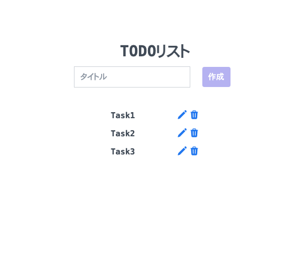

# README

## TODOリスト

### 概要
- TODOリスト（Go + React）

### トップ画像


### 機能
- タスク一覧表示機能

- タスク新規作成機能
  - フォームからタスクの新規作成できます。

- タスク更新機能
  - 各タスクのペンのアイコンからタスクの編集ができます。

- タスク削除機能
  - 各タスクのゴミ箱のアイコンからタスクの削除ができます。

### 使用方法
#### 事前準備
- Docker、docker-composeを使用できるようにしておく。
- このリポジトリをクローンしておく。
#### 環境構築
```sh
cd go_react_todo
docker compose build
docker compose run --rm frontend npm install
docker compose run --rm backend go run migrate/migrate.go
docker compose up -d
```

- localhost:3000 にアクセスする。

### 使用技術
- Golang 1.21.2
- Echo 4.11.2
- React 18.2.0
- PostgreSQL 15.4
- Docker/Docker-compose